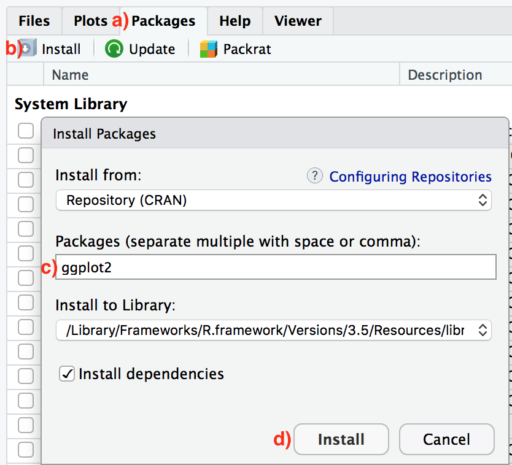

```{r setup, include=FALSE}
library(learnr)
knitr::opts_chunk$set(echo = FALSE)
```

## Welcome

Welcome to DSCI 100, Introduction to Data Science. In this course you will learn to explore, visualize, and analyze data to investigate patterns, model outcomes, and make predictions to understand natural phenomena in a reproducible manner. We will focus on the R statistical computing language. You will gain experience in data wrangling, data visualization, exploratory data analysis, and effective communication of results while working on problems and case studies inspired by and based on real-world questions. No statistical or computing background is necessary. We are going to have a great semester and the TAs and I look forward to working with each of you!

### Outline

This tutorial will introduce you to R and RStudio and help you login to your RStudio account on the Rserver hosted at Bryn Mawr College. In addition, it will introduce how to install a package in RStudio.

* Introduction to R and RStudio
* Access the Rstudio Cloud server hosted at rstudio.brynmawr.edu
* Introduction to the RStudio IDE
* Introduction to R Packages 
* R Package Installation

<div class="marginnote">
The tutorial was adapted from the Shopping Week chapter in Kane, D. "Preceptor's Primer for Bayesian Data." https://davidkane9.github.io/PPBDS/shopping-week.html
</div>

## Introduction to R and RStudio

### Why R

In this course we will be using R as a tool to manipulate, wrangle and analyze data. R is primarily a computer programming language for statistical analysis. It is free, and open-source (many people contribute to developing it), and runs on most operating systems. It is a powerful language that can be used for all sorts of mathematical operations, data-processing, analysis, and graphical display of data. R makes data-analysis fast, efficient, transparent, and reproducible. I even used R to create this tutorial.

### R and RStudio

First time users often get confused by what R and Rstudio are and how they work together. At its simplest, R is a programming language that does the work (runs the computations, plots the graphs, etc), while RStudio is an *integrated development environment (IDE)* that provides a friendly user-interface for interacting and working with R by adding many convenient features and tools. A common analogy that people like to use is that R is like a car’s engine while RStudio is like a car’s dashboard. So just as we don't drive a car by interacting directly with the engine but rather by interacting with elements on the car's dashboard (speedometer, navigation system, break, rearview mirrors, etc.), we won't be using R directly but rather we will use the RStudio's interface to work with R. Equally important, RStudio requires R to run properly - just like the car's dashboard needs the car's engine. 


```{r R-vs-RStudio-1, echo=FALSE, fig.cap="Analogy of difference between R and RStudio.", out.width="95%", purl=FALSE}
knitr::include_graphics("images/R_vs_RStudio_1.png")
```

There are multiple ways of interacting with R and RStudio. One way is to install R and RStudio on your computer and work with it "locally" on your computer. Another way is to interact with RStudio on the internet on an Rserver. In this class, we will work with RStudio on the internet via the RStudio server hosted at Bryn Mawr College (https://rstudio.brynmawr.edu/). 

## Access the BMC RStudio Server 

The RStudio Server provides a web-based way to run analyses in R. This means that you will only need an internet connection and a web browser to run your analyses. You can be running a Windows machine, a Mac, a Linux, or pretty much any other device that has access to the internet and a web browser. The RStudio Server is a great way to gain familiarity with working with R and RStudio and we want to encourage all students to use the BMC RStudio server.

### How to login and access the BMC RStudio Server

Go to: https://rstudio.brynmawr.edu/

* Students preregistered for the course should type in their college email username for both their username and initial password (e.g., my initial login credentials were athapar).

* You will need to change your password by typing in the command passwd in the Terminal Tab of the Console Window. (NOTE: It will look like it is not working but it is.) 

* You will be prompted to enter current password and then prompted to change your password. You will need to enter new password twice.

## Introduction to the RStudio IDE

After you logon to the RStudio server and open RStudio, you should see something similar to Figure 1. If you see 3 window panes instead of 4, that means your "Source" pane has been minimized. At the drop down menu, click on "View", then go "Panes" and click "Show All Panes". 

```{r fig1, echo = FALSE, out.width = "100%", fig.cap = "A session in progress with 3 *window panes* and the 4 *window panes* highlighted in red. The placement of the *panes* are configurable (more on this later) and you might see a configuration with three *panes*."}
knitr::include_graphics("images/rstudio.png")
knitr::include_graphics("images/rstudio_session_4pane_layout.png")
```

In the example above, the bottom left window is the *Terminal/Console pane* (the command line window) for R. This is used to directly enter commands into R. Once you have entered a command here, press enter to execute the command. The console is useful for entering single lines of code and running them. Oftentimes this occurs when you are learning how to correctly execute a line of code in R. Your first few attempts may be incorrect resulting in errors, but trying out different variations on your code in the command line can help you produce the correct code. Pressing the up arrow while in the console will scroll through the most recently executed lines of code.

The top left corner contains the *Source pane*. This is a simple text editor for writing and saving R scripts with many lines. Several tabs can be opened at once, with each tab representing a different R script. R scripts can be saved from the editor (resulting in a .r file). Whole scripts can be run by copy and pasting them into the console and pressing enter. Alternatively, you can highlight portions of the script that you want to run (in the script editor) and press command-enter to automatically run that portion in the console (or press the button for running the current line/section: green arrow pointing right).

The top right panel contains the *Workspace and Hstory pane* and consists of two tabs, one for the workspace and another for history. The workspace lists out all of the variables and functions that are currently loaded in R’s memory. You can inspect each of the variables by clicking on them. This is generally only useful for variables that do not contain large amounts of information. The history tab provides a record of the recent commands executed in the console.

The bottom-right window contains the *File, Plot, Packages, Help pane* and has four tabs for files, plots, packages, and help. The files tab allows browsing of the computers file directory. An important concept in R is the current working directory. This is the file folder that R points to by default. Many functions in R will save things directly to this directory, or attempt to read files from this directory. The current working directory can be changed by navigating to the desired folder in the file menu, and then clicking on the more option to set that folder to the current working directory. This is especially important when reading in data to R. The current working directory should be set to the folder containing the data to be inputted into R. The plots tab will show recent plots and figures made in R. The packages tab lists the current R libraries loaded into memory, and provides the ability to download and enable new R packages. The help menu is an invaluable tool. Here, you can search for individual R commands to see examples of how they are used. Sometimes the help files for individual commands are opaque and difficult to understand, so it is necessary to do a Google search to find better examples of using these commands.

## Introduction to R Packages 

### What are R packages?

Another point of confusion with many new R users is the idea of an R package. R packages extend the functionality of R by providing additional functions, data, and documentation. They are written by a worldwide community of R users and can be downloaded for free from the internet. 

For example, among the many packages we will use in this book are the *ggplot2* package (Wickham, Chang, et al. 2020) for data visualization, the *dplyr* package (Wickham, François, et al. 2020) for data wrangling, and the *stringr* package for string manipulation.

A good analogy for R packages is they are like apps you can download onto a mobile phone. 

```{r R-vs-R-packages, echo=FALSE, fig.align="center", fig.cap="Analogy of R versus R packages.", out.width="70%", purl=FALSE}
knitr::include_graphics("images/R_vs_R_packages.png")
```

So R is like a new mobile phone: while it has a certain amount of features when you use it for the first time, it doesn't have everything. R packages are like the apps you can download onto your phone from Apple's App Store or Android's Google Play. 

Let's continue this analogy by considering the Instagram app for editing and sharing pictures. Say you have purchased a new phone and you would like to share a photo you have just taken with friends on Instagram. You need to:

1. *Install the app*: Since your phone is new and does not include the Instagram app, you need to download the app from either the App Store or Google Play. You do this once and you're set for the time being. You might need to do this again in the future when there is an update to the app.
2. *Open the app*: After you've installed Instagram, you need to open it.

Once Instagram is open on your phone, you can then proceed to share your photo with your friends and family. The process is very similar for using an R package. You need to:

1. *Install the package*: This is like installing an app on your phone. Most packages are not installed by default when you install R and RStudio. Thus if you want to use a package for the first time, you need to install it first. Once you've installed a package, you likely won't install it again unless you want to update it to a newer version.
2. *"Load" the package*: "Loading" a package is like opening an app on your phone. Packages are not "loaded" by default when you start RStudio on your computer; you need to "load" each package you want to use every time you start RStudio.

## R Package Installation 

### How to install R packages

There are two ways to install an R package: an easy way and a more advanced way. Let's install the `ggplot2` package the easy way first as shown in Figure 3. In the Files pane of RStudio:

a) Click on the "Packages" tab.
b) Click on "Install" next to Update.
c) Type the name of the package under "Packages (separate multiple with space or comma):" In this case, type `ggplot2`.
d) Click "Install."  
     
```{r easy-way-install, echo=FALSE, fig.align="center", fig.cap="Installing packages in R the easy way.", out.width="55%", out.height="55%", purl=FALSE}

```     

An alternative but slightly less convenient way to install a package is by typing `install.packages("ggplot2")` in the console pane of RStudio and pressing Return/Enter on your keyboard. Note you must include the quotation marks around the name of the package.

Much like an app on your phone, you only have to install a package once. However, if you want to update a previously installed package to a newer version, you need to re-install it by repeating the earlier steps.

### Loading Packages

Recall that after you've installed a package, you need to "load it." In other words, you need to "open it." We do this by using the `library()` command.  

For example, to load the `ggplot2` package, run the following code in the console pane. What do we mean by "run the following code"? Either type or copy-and-paste the following code into the console pane and then hit the Enter key. 

```{r, eval=FALSE}
library(ggplot2)
```

If after running the earlier code, a blinking cursor returns next to the `>` "prompt" sign, it means you were successful and the `ggplot2` package is now loaded and ready to use. If, however, you get a red "error message" that reads `...` 


```
Error in library(ggplot2): there is no package called ‘ggplot2

```

`...` it means that you didn't successfully install it. This is an example of an "error message". If you get this error message, go back to Subsection on R package installation and make sure to install the `ggplot2` package before proceeding. 

One very common mistake new R users make when wanting to use particular packages is they forget to "load" them first by using the `library()` command we just saw. Remember: *you have to load each package you want to use every time you start RStudio.* If you don't first "load" a package, but attempt to use one of its features, you'll see an error message similar to:

```
Error: could not find function
```

This is a different error message than the one you just saw on a package not having been installed yet. R is telling you that you are trying to use a function in a package that has not yet been "loaded." R doesn't know where to find the function you are using. Almost all new users forget to do this when starting out, and it is a little annoying to get used to doing it. However, you'll remember with practice and after some time it will become second nature for you.

One very common mistake new R users make when wanting to use particular packages is they forget to "load" them first by using the `library()` command we just saw. Remember: *you have to load each package you want to use every time you start RStudio.* If you don't first "load" a package, but attempt to use one of its features, you'll see an error message similar to:

```
Error: could not find function
```

This is a different error message than the one you just saw on a package not having been installed yet. R is telling you that you are trying to use a function in a package that has not yet been "loaded." R doesn't know where to find the function you are using. Almost all new users forget to do this when starting out, and it is a little annoying to get used to doing it. However, you'll remember with practice and after some time it will become second nature for you.

## Summary

In this tutorial, you learned how to access and log into the RStudio server at Bryn Mawr College on your computer. You also had an introduction to the RStudio IDE and it's different *panes* and how to install and load a R package. 

Please post any issues and/or questions with the concepts reviewed in this tutorial in the Piazza Forum Labeled "Getting Started Q&A".
