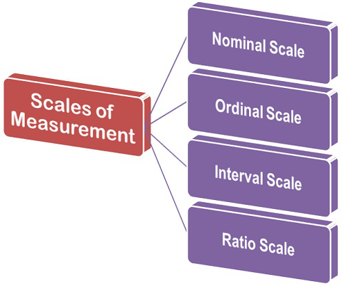

```{r setup, include=FALSE}
library(learnr)
library(tidyverse)
knitr::opts_chunk$set(echo = FALSE)
```

## Welcome

This tutorial provides an overview of the different data types and data structures in R and goes over the scales of measurement. In this tutorial we will go over: 

* Data types in R
* Objects and Variable Assignment
* Data Structures
* Scales of Measurement 
* Continuous versus discrete variables
* Summary

<div class="marginnote">
The scales of measurement section was adapted nearly verbatim from Chapters 1 and 2 in Navarro, D. "Learning Statistics with R." https://compcogscisydney.org/learning-statistics-with-r/
</div>

## Data Types in R

There are 6 data types in R:

1. Integer - Integer are values like -1, 0, 2, 4092. Integers are numbers that do not contain decimal values.
2. Numeric - Numeric (aka doubles) are numbers that have fractions or decimal values like -24.932 and 0.8. 
3. Complex - Complex data type is used to store numbers with an imaginary component defined as the pure imaginary value i (such as 1+2i). 
4. Character -  Characters are text such as “apple”, “Hamilton”, “Agents of Shield is an awesome TV show”, and “This ramen is delicious.” Note that characters (aka strings) are often denoted with the quotation marks around them. 
5. Logical - Logical data (aka Boolean values) are a special data type for data with only two possible values, TRUE or FALSE. It is worth noting that R can perform calculations with logical values as it stores TRUE values as 1 and FALSE values as 0.
6. Factor - Factors are a special case of character variables in the sense that it also contains text. However, factor variables are used when there are a limited number of unique character strings. It often represents a categorical variable. 

We can check the type of a variable by using the *typeof()* or *class()* function. We can also change the type of a variable to another type (X) using the function *as.x()*. This process is called “coercion”. For example, the function **as.character()** changes the number 6507232300 to the character string "6507232300":


```{r conversion, exercise=TRUE}
as.character(6507232300)

```

Sometimes type conversion does not work as you might expect. Always check that the result is what you want!

```{r conversionNA, exercise=TRUE}
as.numeric("def")
```

Here the function returns a warning and *NA*. In R, you will see *NA* when you try certain operations that are illegal or don't make sense. Missing values are also represented in R by the NA symbol. NOTE: NA is one of the very few reserved words in R: you cannot give anything this name. (Because R is case-sensitive, na and Na are okay to use, although I don't recommend them.) Here are some other examples of operations that produce NA's.

```{r NAerrors, exercise=TRUE}
var(8)  

as.numeric (c("1", "2", "three", "4")) 

```

What just happened?

1. We asked R to use the R function *var()* to give us the variance in a set of scores but only provided 1 score so R cannot compute the variance when only give 1 value.
2. We asked R to convert the 4 character values in *c* as numeric values. It is not able to convert a string value into a numeric. three  in c to  object 

## Objects and Variable Assignments

R lets you save data by storing it inside an R object. What is an object? Just a name that you can use to call up stored data. For example, you can save data into an object by giving it a name, like *C* or *myobject*. Wherever R encounters the object, it will replace it with the data saved inside, like so:


```{r object, exercise=TRUE}
x <- 1
x

x + 2

```

What just happened?

1. To create an R object, choose a name and then use the less-than symbol, <, followed by a minus sign, -, to save data into it. This combination looks like an arrow, <-, and is referred to as the assignment operator. R will make an object, give it your name, and store in it whatever follows the arrow. So x <- 1 stores 1 in an object named x. (NOTE: **Do not use the = sign to assign values to variables!** Although it works in R, it can cause a lot of confusion so avoid using it.)
2. When you ask R what’s in x, R tells you on the next line.
3. You can use your object in new R commands, too. Since a previously stored the value of 1, you’re now adding 1 to 2.

So, for another example, the following code would create an object named dice that contains the numbers one through six. To see what is stored in an object, just type the object’s name by itself:


```{r objectdice, exercise=TRUE}
dice <- 1:6

dice

```
What just happened? 

We created a object called dice and stored the numbers 1 to 6 in it. Note: The colon operator (:) returns every integer between two integers and is an easy way to create a sequence of numbers.

### Naming Conventions

You can name an object in R almost anything you want, but there are a few rules. 

1. A name cannot start with a number (4comment will cause an error, comment4 is ok). 
2. Second, a name cannot use some special symbols, like ^, !, $, @, +, -, or /. 
3. R is case-sensitive, so name, Name, NAME, and naMe will all refer to different objects.
4. Finally, R is not very forgiving. It will overwrite any previous information stored in an object **without asking you for permission**. So, it is a good idea to not use names that are already taken. 


## Data Structures

The different data types that we described above are the basic building blocks of any kind of data in R programming. They assign meaning to values in R and also tell R how to process and how not to process them. Just as there are different data types in R, there are also a number of different objects types or data structures in R.

R’s basic data structures include the vector, list, matrix, data frame, and factors. Some of these structures require that all entries be of the same data type (e.g. vectors, matrices) while others permit multiple data types (e.g. lists, data frames).

```{r objects2, echo=FALSE, fig.cap="Data Structures in R.", out.width="95%", purl=FALSE}
knitr::include_graphics("images/dataStructuresNew.png")
```

For now, let's focus on vector, matrix and data frame. The object *dice* is an example of a *vector*. A vector is a 1-dimensional array whose entries are the same type (numeric or text). A matrix is a 2-dimensional array consisting of multiple vectors. A matrix is still limited to one data type. A data frame is similar to a matrix but can support vectors of different data types.

### Exercise 1 

```{r quiz1}
quiz(
  question("What type of data is the value 14?",
    answer("base"),
    answer("tools"),
    answer("utils", correct = TRUE),
    answer("codetools")
  ),
  question("Which of the R packages listed below are used to create plots?",
    answer("as.factor", correct = TRUE),
    answer("as.logical"),
    answer("as.complex"),
    answer("grid")
  )
)
```


## Scales of measurement

We measure a lot of variables. But not all variables are of the same qualitative type, and it’s very useful to understand what types there are. A very useful concept for distinguishing between different types of variables is what’s known as **scales of measurement**. In statistics, variables are classified into 4 different types.

```{r variables, echo=FALSE, fig.cap="Scales of Measurement.", out.width="95%", purl=FALSE}

```

### Nominal scale

A **nominal scale** variable (also referred to as a **categorical** variable) is one in which there is no particular relationship between the different possibilities: for these kinds of variables it doesn’t make any sense to say that one of them is "bigger" or “better” than any other one, and it absolutely doesn’t make any sense to average them. The classic example for this is “eye color”. Eyes can be blue, green and brown, among other possibilities, but none of them is any “better” than any other one. As a result, it would feel really weird to talk about an “average eye color”. Similarly, marital status  is nominal too: single isn’t better or worse than marries, neither does it make sense to try to talk about an “average marital status”. In short, nominal scale variables are those for which the only thing you can say about the different possibilities is that they are different. That’s it.

Let’s take a slightly closer look at this. Suppose I was doing research on how people commute to and from work. One variable I would have to measure would be what kind of transportation people use to get to work. This “transport type” variable could have quite a few possible values, including: “train”, “bus”, “car”, “bicycle”, etc. For now, let’s suppose that these four are the only possibilities, and suppose that when I ask 100 people how they got to work today, and I get this:

  Transportation    Number of people
  ---------------- ------------------
  (1) Train               12
  (2) Bus                 30
  (3) Car                 48
  (4) Bicycle             10

So, what’s the average transportation type? Obviously, the answer here is that there isn’t one. It’s a silly question to ask. You can say that travel by car is the most popular method, and travel by train is the least popular method, but that’s about all. Similarly, notice that the order in which I list the options isn’t very interesting. I could have chosen to display the data like this and nothing really changes.

  Transportation    Number of people
  ---------------- ------------------
  (3) Car                 48
  (1) Train               12
  (4) Bicycle             10
  (2) Bus                 30


### Ordinal scale

**Ordinal scale** variables have a bit more structure than nominal scale variables, but not by a lot. An ordinal scale variable is one in which there is a natural, meaningful way to order the different possibilities, but you can’t do anything else. The usual example given of an ordinal variable is “finishing position in a race”. You <span>**can**</span> say that the person who finished first was faster than the person who finished second, but you <span>**don’t**</span> know how much faster. As a consequence we know that 1st was faster than the 2nd, and we know that 2nd was faster than the 3rd, but the difference between 1st and 2nd might be much larger than the difference between 2nd and 3rd.

Here’s a potentially more interesting example. Suppose I’m interested in people’s attitudes to climate change, and I ask them to pick one of these four statements that most closely matches their beliefs:

> (1) Temperatures are rising, because of human activity\
> (2) Temperatures are rising, but we don’t know why\
> (3) Temperatures are rising, but not because of humans\
> (4) Temperatures are not rising

Notice that these four statements actually do have a natural ordering, in terms of “the extent to which they agree with the current science”. Statement 1 is a close match, statement 2 is a reasonable match, statement 3 isn’t a very good match, and statement 4 is in strong opposition to the science. So, in terms of the thing I’m interested in (the extent to which people endorse the science), I can order the items as $1 > 2 > 3 > 4$. Since this ordering exists, it would be very weird to list the options like this…

> (1) Temperatures are rising, but not because of humans\
> (2) Temperatures are rising, because of human activity\
> (3) Temperatures are not rising\
> (4) Temperatures are rising, but we don’t know why

…because it seems to violate the natural “structure” to the question.

So, let’s suppose I asked 100 people these questions, and got the following answers:

                                                             Number
  --------------------------------------------------------- --------
  (1) Temperatures are rising, because of human activity      51
  (2) Temperatures are rising, but we don’t know why          20
  (3) Temperatures are rising, but not because of humans      10
  (4) Temperatures are not rising                             19

When analyzing these data, it seems quite reasonable to try to group (1), (2) and (3) together, and say that 81 of 100 people were willing to <span>*at least partially*</span> endorse the idea of climate change. And it’s <span>*also*</span> quite reasonable to group (2), (3) and (4) together and say that 49 of 100 people registered <span>*at least some disagreement*</span> with the dominant scientific view that climate change is due to human activity. However, it would be entirely bizarre to try to group (1), (2) and (4) together and say that 90 of 100 people said......what? There’s nothing sensible that allows you to group those responses together at all.

That said, notice that while we <span>*can*</span> use the natural ordering of these items to construct sensible groupings, what we <span>*can’t*</span> do is average them. For instance, in my simple example here, the “average” response to the question is 1.97. But what does that mean?

### Interval scale

In contrast to nominal and ordinal scale variables, **interval scale** and ratio scale variables are variables for which the numerical value is genuinely meaningful. In the case of interval scale variables, the <span>*differences*</span> between the numbers are interpretable, but the variable doesn’t have a “natural” zero value. A good example of an interval scale variable is measuring temperature in degrees celsius. For instance, if it was 15$^\circ$ yesterday and 18$^\circ$ today, then the 3$^\circ$ difference between the two is genuinely meaningful. Moreover, that 3$^\circ$ difference is <span>*exactly the same*</span> as the 3$^\circ$ difference between $7^\circ$ and $10^\circ$. In short, addition and subtraction are meaningful for interval scale variables.

However, notice that the $0^\circ$ does not mean “no temperature at all”: it actually means “the temperature at which water freezes”, which is pretty arbitrary. As a consequence, it becomes pointless to try to multiply and divide temperatures. It is wrong to say that $20^\circ$ is <span>*twice as hot*</span> as $10^\circ$, just as it is weird and meaningless to try to claim that $20^\circ$ is negative two times as hot as $-10^\circ$.

Again, lets look at a slightly more interesting example. Suppose I’m interested in looking at how the attitudes of first-year university students have changed over time. Obviously, I’m going to want to record the year in which each student started. This is an interval scale variable. A student who started in 2003 did arrive 5 years before a student who started in 2008. However, it would be completely insane for me to divide 2008 by 2003 and say that the second student started “1.0024 times later” than the first one. That doesn’t make any sense at all.

### Ratio scale

The fourth and final type of variable to consider is a **ratio scale** variable, in which zero really means zero, and it’s okay to multiply and divide. A good psychological example of a ratio scale variable is response time (RT). In a lot of tasks it’s very common to record the amount of time somebody takes to solve a problem or answer a question, because it’s an indicator of how difficult the task is. Suppose that Alan takes 2.3 seconds to respond to a question, whereas Ben takes 3.1 seconds. As with an interval scale variable, addition and subtraction are both meaningful here. Ben really did take $3.1 - 2.3 = 0.8$ seconds longer than Alan did. However, notice that multiplication and division also make sense here too: Ben took $3.1 / 2.3 = 1.35$ times as long as Alan did to answer the question. And the reason why you can do this is that, for a ratio scale variable such as RT, “zero seconds” really does mean “no time at all”.

**Why do we care about scales of measurements?**

Our choices for the scales of measurement we use to measure variables are meaningful - but why?

We care about scales of measurement because they determine what we can do, mathematically, with the data we get when we measure. Remember the example introduced above - sometimes we want to summarize by computing an average. But what is the average martial status, for example, of a group of people? This makes no sense, as you cannot multiply and divide marital status. You can, however, count the number of single, married, divorced and widowed people in a group and report the counts and/or percentages or proportions.

**What can we do, mathematically, with each scale?**

Nominal: the nominal scale of measurement is limited to counting frequencies in each category.
There are five women and three men in the group.

Ordinal: we can put items in order, and say that something is more or less than something else. We can establish order.

I like math more than I like English.
Rider A crossed the finish line before Rider B.

Interval: interval scales allow for addition and subtraction. It is possible to discuss that amount is more, less, or equal to another, but we cannot multiply or divide them.

Ratio: you can compute the average of numbers by assuming that the amount is meaningful in terms of units of the scale of measurement you are using. This type of scale has an absolute zero, where zero means no amount of the quantity  being measured.

### Exercise 2 

```{r quiz2}
quiz(
  question("Wages per hour is an example of what type of scale?",
    answer("Nominal"),
    answer("Ordinal"),
    answer("Interval"),
    answer("Ratio", correct = TRUE)
  ),
  question("A researcher is examining the relationship between texting and driving skill in students. The researcher uses orange traffic cones to set up a driving circuit in a parking lot. A group of students is then tested on the circuit, once while receiving and sending text messages, and once without texting. For each student, the researcher records a Yes/No to indicate whether the student hit a cone while driving each circuit. The scale used to measure driving skill is an example of?",
    answer("Nominal", correct = TRUE),
    answer("Ordinal"),
    answer("Interval"),
    answer("Ratio")
  )
)
```

## Continuous versus discrete variables

There’s a second kind of distinction that you need to be aware of, regarding what types of variables you can run into. This is the distinction between continuous variables and discrete variables. The difference between these is as follows:

-   A **continuous variable** is one in which, for any two values that you can think of, it’s always logically possible to have another value in between.

-   A **discrete variable** is, in effect, a variable that isn’t continuous. For a discrete variable, it’s sometimes the case that there’s nothing in the middle.

These definitions probably seem a bit abstract, but they’re pretty simple once you see some examples. For instance, response time is continuous. If Alan takes 3.1 seconds and Ben takes 2.3 seconds to respond to a question, then it’s possible for Cameron’s response time to lie in between, by taking 3.0 seconds. And of course it would also be possible for David to take 3.031 seconds to respond, meaning that his RT would lie in between Cameron’s and Alan’s. And while in practice it might be impossible to measure RT that precisely, it’s certainly possible in principle. Because we can always find a new value for RT in between any two other ones, we say that RT is continuous.

Discrete variables occur when this rule is violated. For example, nominal scale variables are always discrete: there isn’t a type of transportation that falls “in between” trains and bicycles, not in the strict mathematical way that 2.3 falls in between 2 and 3. So transportation type is discrete. Similarly, ordinal scale variables are always discrete: although “2nd place” does fall between “1st place” and “3rd place”, there’s nothing that can logically fall in between “1st place” and “2nd place”. Interval scale and ratio scale variables can go either way. As we saw above, response time (a ratio scale variable) is continuous. Temperature in degrees celsius (an interval scale variable) is also continuous. However, the year you went to school (an interval scale variable) is discrete. There’s no year in between 2002 and 2003. The number of questions you get right on a true-or-false test (a ratio scale variable) is also discrete: since a true-or-false question doesn’t allow you to be “partially correct”, there’s nothing in between 5/10 and 6/10. The table summarizes the relationship between the scales of measurement and the discrete/continuity distinction. Cells with a tick mark correspond to things that are possible. I’m trying to hammer this point home, because (a) some textbooks get this wrong, and (b) people very often say things like “discrete variable” when they mean “nominal scale variable”. It’s very unfortunate.


              continuous   discrete
  ---------- ------------ ----------
  nominal                     x
  ordinal                     x
  interval        x           x
  ratio           x           x

The relationship between the scales of measurement and the discrete/continuity distinction. Cells with an x correspond to things that are possible.

### Some complexities

Okay, I know you’re going to be shocked to hear this, but …the real world is much messier than this little classification scheme suggests. Very few variables in real life actually fall into these nice neat categories, so you need to be kind of careful not to treat the scales of measurement as if they were hard and fast rules. It doesn’t work like that: they’re guidelines, intended to help you think about the situations in which you should treat different variables differently. Nothing more.

So let’s take a classic example, maybe <span>*the*</span> classic example, of a psychological measurement tool: the **Likert scale**. The humble Likert scale is the bread and butter tool of all survey design. You yourself have filled out hundreds, maybe thousands of them, and odds are you’ve even used one yourself. Suppose we have a survey question that looks like this:

> Which of the following best describes your opinion of the statement that “all pirates are freaking awesome” …

and then the options presented to the participant are these:

> \(1) Strongly disagree\
> (2) Disagree\
> (3) Neither agree nor disagree\
> (4) Agree\
> (5) Strongly agree

This set of items is an example of a 5-point Likert scale: people are asked to choose among one of several (in this case 5) clearly ordered possibilities, generally with a verbal descriptor given in each case. However, it’s not necessary that all items be explicitly described. This is a perfectly good example of a 5-point Likert scale too:

> \(1) Strongly disagree\
> (2)\
> (3)\
> (4)\
> (5) Strongly agree

Likert scales are very handy, if somewhat limited, tools. The question is, what kind of variable are they? They’re obviously discrete, since you can’t give a response of 2.5. They’re obviously not nominal scale, since the items are ordered; and they’re not ratio scale either, since there’s no natural zero.

But are they ordinal scale or interval scale? One argument says that we can’t really prove that the difference between “strongly agree” and “agree” is of the same size as the difference between “agree” and “neither agree nor disagree”. In fact, in everyday life it’s pretty obvious that they’re not the same at all. So this suggests that we ought to treat Likert scales as ordinal variables. On the other hand, in practice most participants do seem to take the whole “on a scale from 1 to 5” part fairly seriously, and they tend to act as if the differences between the five response options were fairly similar to one another. As a consequence, a lot of researchers treat Likert scale data as if it were interval scale. It’s not interval scale, but in practice it’s close enough that we usually think of it as being **quasi-interval scale**.

## Summary

In this tutorial, we reviewed data types and data structures. We also reviewed the scales of measurement and the mathematical operators that can be applied to them.

Please post any issues and/or questions with the concepts reviewed in this tutorial in the Piazza Forum Labeled Tutorial-01.

Upon completion of this tutorial, go to the course Moodle page and complete Assessment Activity #1. The completed assessment activity is due by midnight on Wednesday Sept. 16. 

